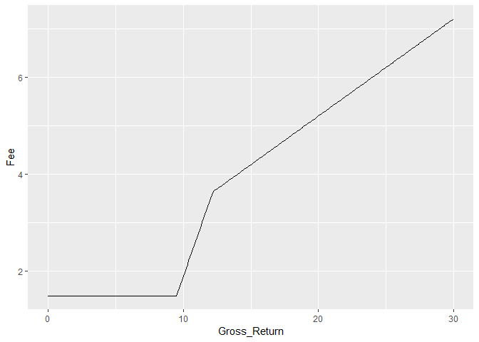
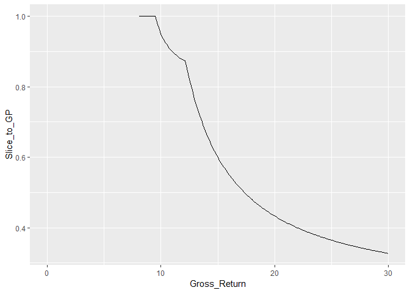
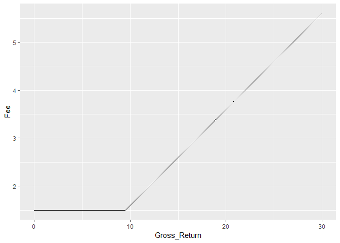
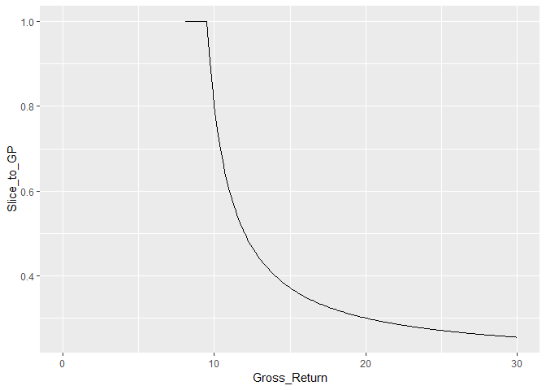

Fee Effectiveness in a Typical PE Structure
================

We will analyze fee effictiveness in a typical PE structure using tools in the asrsMethods library.

``` r
library(asrsMethods,quietly=TRUE, verbose=FALSE)
library(ggplot2,quietly=TRUE,verbose=FALSE)
```

Let's setup a PE investment with market standard terms of 1.5% asset management fee, 20% carry over an 8% hurdle with an 80% catchup.

``` r
dmat.pe=data.frame(am=1.5,pref=8,catchup=.8,carry=.2)
ans.pe=gpcomp(dmat.pe,ret=seq(100,130,.1))
df=data.frame(Gross_Return=ans.pe$grossreturn,Net_Return=ans.pe$netreturn)
df$Fee=df$Gross_Return-df$Net_Return
bench=8
df$Excess_Return=df$Gross_Return-bench
df$Excess_Return[df$Excess_Return<=0]=NA
df$Slice_to_GP=pmin(1,df$Fee/df$Excess_Return)
ggplot(df,aes(x=Gross_Return,y=Fee))+geom_line()
```



``` r
ggplot(df,aes(x=Gross_Return,y=Slice_to_GP)) + geom_line()
```



Now let's do it with a 0% catchup.

``` r
dmat.pe=data.frame(am=1.5,pref=8,catchup=0,carry=.2)
ans.pe=gpcomp(dmat.pe,ret=seq(100,130,.1))
df=data.frame(Gross_Return=ans.pe$grossreturn,Net_Return=ans.pe$netreturn)
df$Fee=df$Gross_Return-df$Net_Return
bench=8
df$Excess_Return=df$Gross_Return-bench
df$Excess_Return[df$Excess_Return<=0]=NA
df$Slice_to_GP=pmin(1,df$Fee/df$Excess_Return)
ggplot(df,aes(x=Gross_Return,y=Fee))+geom_line()
```



``` r
ggplot(df,aes(x=Gross_Return,y=Slice_to_GP)) + geom_line()
```




